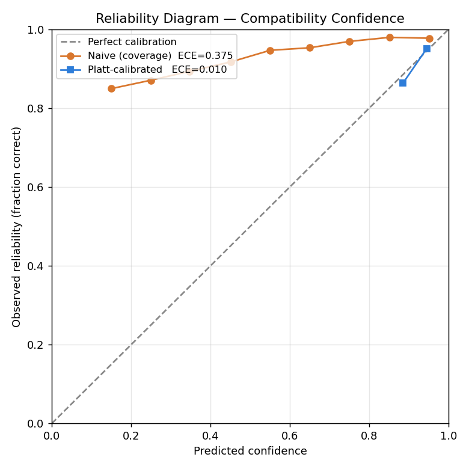

# Calibration Evidence — Confidence Model

Held-out test set: **8000** synthetic samples (seed 2024), 10-bin ECE. Reproduce: `uv run python ../../scripts/calibration_evidence.py`.

| confidence source | Expected Calibration Error (ECE) |
|---|---|
| Naive (signal coverage) | 0.3748 |
| Platt-scaled (logistic regression) | 0.0099 |

**Platt scaling reduces ECE by 97%** (0.375 → 0.010).

**Interpretation:** the naive coverage proxy is over/under-confident — its curve departs from the diagonal. The Platt-scaled model's points sit closer to the diagonal, i.e. when it says 70% it is right ~70% of the time. ECE quantifies that gap; lower is better.
