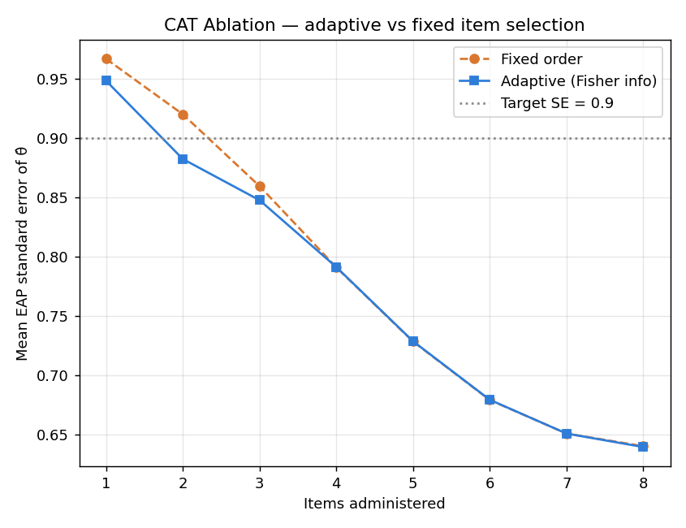

# CAT Ablation — Adaptive vs Fixed Item Selection

600 simulated examinees (θ ~ N(0,1)), real 8-item 3PL bank, target SE 0.90. Reproduce: `uv run python ../../scripts/cat_ablation.py`.

| strategy | mean items to reach SE ≤ 0.90 | mean SE after 2 items | mean SE after 4 items |
|---|---|---|---|
| Fixed order | 3.00 | 0.920 | 0.791 |
| Adaptive (Fisher) | 2.00 | 0.882 | 0.791 |

**Reading the result (honest version).** Fisher-information selection lowers θ̂ standard error fastest in the **early items** — after 2 items it is **4% more precise** than fixed order, reaching SE ≤ 0.90 in **2.0** items vs **3.0** for fixed. By item ~4 the two policies **converge**: an 8-item bank has so few high-information items that, once administered, item *order* no longer matters.

**Actionable finding.** On this bank the EAP standard error floors at **≈0.64** after all 8 items — it never reaches the deployed early-stop threshold `_STOP_SE = 0.35`, so the live CAT currently always administers the full bank. The fix is not more algorithm but **more items**: Fisher-information selection's payoff (fewer items for the same precision) grows with bank size, which is exactly where adaptive testing earns its keep in production-scale instruments.
