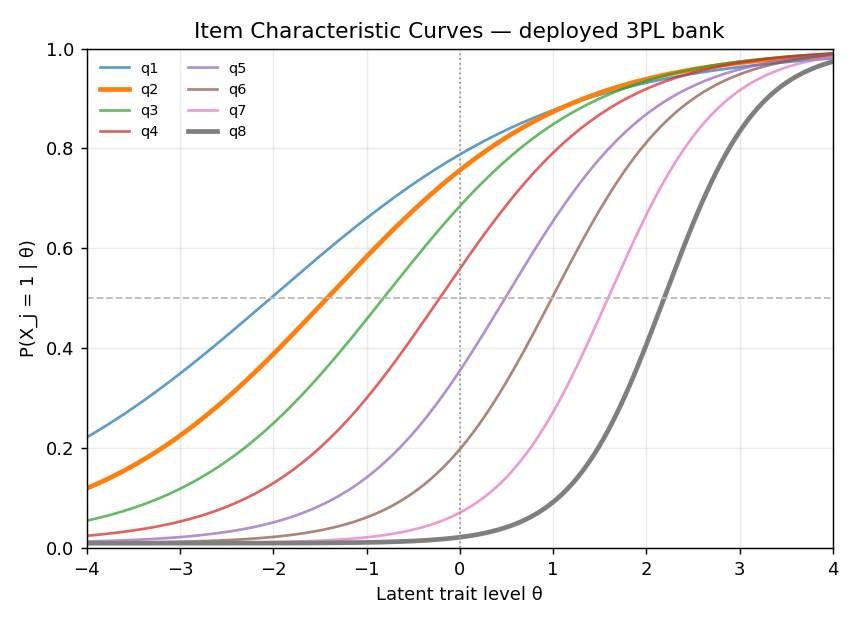

# Item Characteristic Curves — 3PL Bank

The CAT uses a 3-parameter logistic item characteristic curve (ICC):

$$P(X_j = 1 \mid \theta) = c_j + \frac{1 - c_j}{1 + e^{-a_j(\theta - b_j)}}$$

Higher-discrimination items are steeper, while higher-difficulty items shift right. That is why the bank starts with q2/q3 rather than the hardest item q8.

| item | P(θ=0) | note |
|---|---:|---|
| q2 | 0.756 | high information near the prior mean |
| q8 | 0.022 | almost uninformative at the start |

